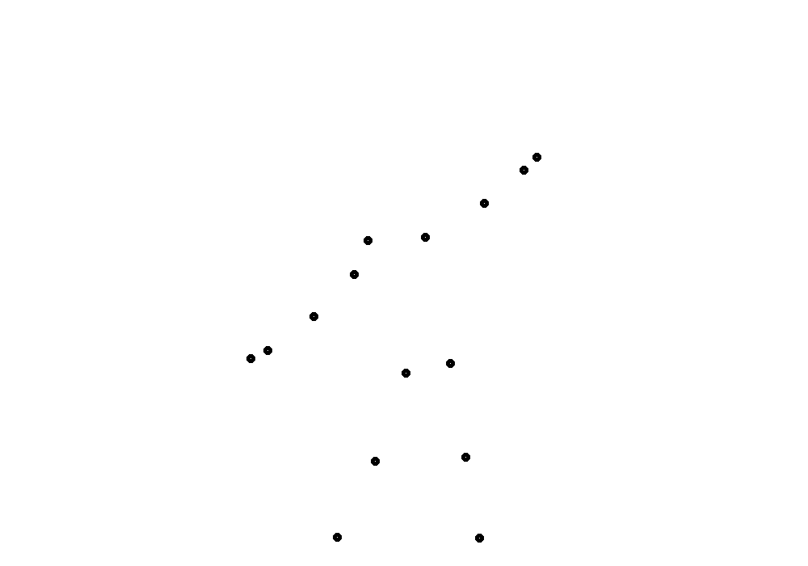

# Pose-Estimator
## Getting Started
Clone The Repository    :
```bash
   git clone https://github.com/AI-Swasthyam/Pose-Classifier
   cd Pose-Classifier
```
### Requirements
* Python 3.7 (numpy, skimage, scipy, opencv)  
* PyTorch >= 1.9.1
* mediapipe library [installation](https://google.github.io/mediapipe/getting_started/install.html)

### Training
``` bash
    python3 -m poseEst.modelLib.train
```
### Dataset
* Download [dataset](https://www.kaggle.com/nandwalritik/yoga-pose-videos-dataset) from here place it inside datasets folder and unzip it, for refrence please see the attached image for directory structure.


### Visualization of what our model is trying to learn ?


### Note
* Final Training weights to be updated !

